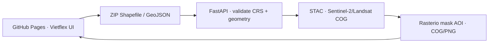

# Vietflex Map · Giám sát biến động theo ranh giới hành chính

WebGIS static-first cho GitHub Pages, dùng [Vietflexmap/VN](https://github.com/Vietflexmap/VN) làm lõi bản đồ, snapshot địa giới hiện hành từ [Vietflexmap/sapnhap](https://github.com/Vietflexmap/sapnhap) và lớp ranh giới PMTiles từ [Vietflexmap/anhmap](https://github.com/Vietflexmap/anhmap).

## Đã cải tiến

- Chọn **34 tỉnh/thành → phường/xã/đặc khu** theo snapshot 2025–2026: 3.321 đơn vị cấp xã, gồm 697 phường, 2.611 xã và 13 đặc khu.
- Không còn danh sách quận/huyện và mã 63 tỉnh cũ trong luồng mặc định.
- Click polygon PMTiles hoặc dùng bộ chọn để xác định AOI; giao diện chỉ gửi mã ĐVHC, không tin geometry do trình duyệt tự vẽ.
- Vietflex làm map core; có Google Maps roadmap, satellite, hybrid, terrain và liên kết mở đúng vị trí trên Google Earth.
- Nút **Tải ảnh đã clip** dùng route upload Shapefile/GeoJSON, lấy ảnh COG mở qua STAC và clip server-side bằng Rasterio.
- Có backend FastAPI mở trong `backend/app.py` + `backend/clip_pipeline.py`; Earth Engine chỉ là route giám sát tùy chọn.

## Kiến trúc



Ranh giới hiển thị phía trình duyệt lấy từ PMTiles đã pin để tải nhanh. Khi
cắt ảnh, backend đọc chính file ranh giới người dùng gửi, bắt buộc CRS, sửa
hình học, dissolve và dùng cùng AOI cho mọi band:

```text
read Shapefile → make_valid → dissolve
rasterio.mask.mask(AOI, crop=True)
GeoTIFF mask/NoData + PNG alpha=0 ngoài AOI
```

Diện tích `area_ha` được tính bằng `EPSG:6933` (equal-area), còn GeoJSON trả về dùng tọa độ WGS84 để hiển thị trên bản đồ web.

## Chạy giao diện

```bash
python3 -m http.server 8080
```

Mở `http://localhost:8080`. Giao diện tải `admin.json` theo commit cố định và nạp PMTiles từ `anhmap` theo commit cố định. Nếu chỉ muốn kiểm thử UI, giữ cấu hình demo mặc định.

Để nối API thật, thêm trước thẻ `assets/app.js`:

```html
<script>
  window.GIAM_SAT_CONFIG = {
    apiBase: "https://api.example.vn",
    clipPath: "/api/v1/clip/jobs",
    monitorPath: "/api/v1/monitor/jobs",
    demoMode: false,
    useLegacyGoogleTiles: true
  };
</script>
```

`useLegacyGoogleTiles: true` bám đúng adapter tương thích trong Vietflex và không cần khóa, nhưng URL Google legacy không phải Map Tiles API công khai được Google cam kết ổn định. Production nên cấp `googleApiKey` runtime cho Map Tiles API chính thức, giới hạn theo HTTP referrer/API và tuân thủ attribution. Không commit khóa vào repository.

## Hợp đồng API cắt ảnh

Giao diện gửi `multipart/form-data` tới `POST /api/v1/clip/jobs`:

```text
boundary_file = ranh_gioi.zip       # .shp + .shx + .dbf + .prj
satellite     = s2                   # s2 | landsat9
start_date    = 12/06/2026
end_date      = 12/09/2026
cloud_max     = 80
output        = geotiff,png,geojson
render_mode   = true_color
```

API trả `202` và `job_id`; client poll trạng thái rồi nhận URL `clip.tif`,
`clip.png` và `aoi.geojson`. Chỉ khi kiểm tra không còn pixel hợp lệ ngoài AOI
mới trả `clip_verified: true`.

## Hợp đồng API giám sát biến động tùy chọn

Giao diện gửi `POST /api/v1/monitor/jobs`:

```json
{
  "admin_code": "00004",
  "admin_level": "commune",
  "province_code": "01",
  "unit_code": "00004",
  "satellite": "s2",
  "monitor_type": "-",
  "start_dk": "11/03/2026",
  "end_dk": "11/06/2026",
  "start_ck": "12/06/2026",
  "end_ck": "12/09/2026",
  "min_area": 0.1,
  "max_area": null,
  "clip_to_admin_boundary": true,
  "output": ["geojson", "geotiff", "png"]
}
```

API trả `202` và `job_id`. Client poll `GET /api/v1/monitor/jobs/{job_id}` rồi tải `result_url`. GeoJSON cần có metadata tương tự:

```json
{
  "clip_verified": true,
  "admin_code": "00004",
  "clip_method": "ee.Image.clip(AOI) + reduceToVectors(geometry=AOI)",
  "area_crs": "EPSG:6933",
  "geotiff_url": "https://..."
}
```

Client từ chối kết quả có `admin_code` khác AOI đang chọn; kết quả không có `clip_verified` chỉ được hiển thị như chưa xác nhận clip.

## Chạy backend

Route cắt ảnh mở không cần API key Earth Engine. Cài `requirements.txt`, sau đó
chạy FastAPI; mặc định backend dùng Microsoft Planetary Computer STAC và ký
URL asset tự động.

```bash
cd backend
python3 -m venv .venv
. .venv/bin/activate
pip install -r requirements.txt
cp .env.example .env
uvicorn app:app --host 0.0.0.0 --port 8080
```

Route `/api/v1/monitor/jobs` cũ cần cài thêm `requirements-ee.txt`, cấu hình
Earth Engine project/asset và Application Default Credentials. Không đưa
service-account JSON, private key, token STAC hay API key vào frontend. Job
store và output hiện ở RAM/local disk để chạy thử; production nhiều instance
cần Redis/Postgres + hàng đợi và Cloud Storage/S3 cho COG.

Pipeline tham chiếu:

- Sentinel‑2: `COPERNICUS/S2_SR_HARMONIZED`, mask SCL lớp mây/bóng mây, reflectance scale `0.0001`.
- Landsat 9: `LANDSAT/LC09/C02/T1_L2`, mask `QA_PIXEL`, scale `0.0000275` và offset `-0.2`.
- Clip ảnh mở: Planetary Computer STAC `sentinel-2-l2a` và `landsat-c2-l2`, đọc COG theo HTTP range.
- Composite median theo hai khoảng không chồng lấn; chỉ số NBR; ngưỡng thay đổi ban đầu `0.15`.
- Lọc diện tích tối thiểu/tối đa ở server sau vector hóa; ghi metadata về collection, thời gian, scale, mask, CRS và số cảnh.

Ngưỡng `0.15` chỉ là cấu hình khởi đầu, không phải ngưỡng pháp lý. Cần hiệu chỉnh theo mùa, chất lượng ảnh và kiểm định thực địa trước khi dùng cho quyết định quản lý rừng.

## Nguồn và giới hạn

- Vietflex CDN và source: `VN@6144d565fcf236727577ab3c4471bbe49f86892f`.
- Thuộc tính địa giới: `sapnhap@908cbf40d3dab31bf4deb16bc49dba17cd88bafb/data/admin.json`.
- Ranh giới PMTiles: `anhmap@e80f4ee9f1e167817e4a9af8402c0bca4052573e/index.html`.
- Snapshot địa giới là nguồn tham khảo kỹ thuật; kiểm tra văn bản pháp lý gốc trước khi dùng cho quyết định có tính pháp lý.
- Google Maps/Google Earth, Sentinel‑2 và Landsat có điều khoản ghi nguồn riêng; nền bản đồ và ảnh không thuộc giấy phép mã nguồn Vietflex.

## GitHub Pages

Workflow nằm tại `.github/workflows/pages.yml` và hiện chạy thủ công để không lỗi khi Pages chưa bật. Vào `Settings → Pages`, chọn `Source: GitHub Actions`, sau đó chạy `Deploy Vietflex Map WebGIS` trong tab **Actions**. Backend không nên chạy trên GitHub Pages; triển khai riêng trên Cloud Run hoặc máy chủ có HTTPS.

Thiết kế: **Long Ngo · Vietflex Map**.
